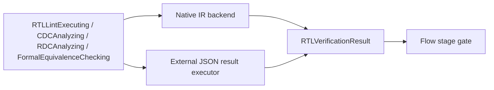

# RTLVerificationEngine Design

## Purpose

Static RTL quality, clock/reset-domain analysis and formal equivalence contracts.

## Responsibility boundary

This package owns the schemas and engine protocols listed in its public products. It must remain usable without UI state and without the Xcircuite runtime.

## Non-responsibilities

- Mutating RTL or mapped netlists
- Functional waveform simulation
- Scan insertion

## Dependency direction

```text
standard artifacts / canonical references
                 ↓
RTLVerificationEngine protocols and result schemas
                 ↓
native or external-tool backends
                 ↓
Xcircuite stage integration
                 ↓
DesignFlowKernel and .xcircuite artifacts
```

Backends may depend on lower-level data packages. This package must never import `Xcircuite` or `circuit-studio`.

The package has two backend forms behind the same product protocols:



The native frontend is subset-scoped by design and consumes `SystemVerilogFrontend` through the verification contract. It records ordered implementation/reference source sets, include provenance, unsupported constructs, source artifact digests and preprocessing coverage, and blocks when the request policy does not allow them. The canonical subset includes parameters, case statements, hierarchy and generate blocks; complete IEEE preprocessing and elaboration remain outside the current boundary. The external executor accepts a result only when its descriptor declares the requested analysis/proof view and its injected ToolQualification decision is eligible.

## Trust model

Kernel availability, corpus validation, oracle correlation, process-scoped qualification and release approval are distinct states. The package reports capability and evidence; Xcircuite and ToolQualification apply flow policy.

## Artifact requirements

All outputs are immutable run artifacts with format, digest, producer metadata and the input design/PDK revision needed to reproduce the result.

`FileSystemRTLArtifactStore` receives an artifact root and
`RTLArtifactNamespace`. It validates every namespace, run, and artifact path
segments, rejects traversal and symbolic-link escapes, and creates each path
once using a completed temporary file and an atomic hard-link create. The root
is revalidated before and after directory creation so a late symbolic-link or
non-directory replacement is rejected. Repeating identical bytes is a typed duplicate error; different bytes at
the same path are a typed conflict. `InMemoryRTLArtifactStore` enforces the same
immutability contract. Neither implementation owns `.xcircuite`, project
manifests, run ledgers, approval, or resume state.

Every execution persists a JSON report. Formal mismatches additionally persist counterexample JSON through the injected artifact writer. The report includes the canonical input references, findings, waivers, proof view, assumptions, raw evidence assessment, and semantic/constraint coverage. It does not encode a release verdict.
