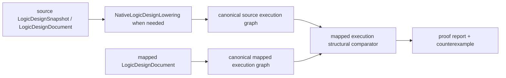

# RTLVerificationEngine Interface Contract

## Common shape

```swift
public protocol DomainExecuting: Sendable {
    func execute(
        _ request: DomainRequest
    ) async throws -> XcircuiteEngineResultEnvelope<DomainPayload>
}
```

Requests carry a schema version, run ID, typed implementation/reference artifact sets, frontend policy, explicit proof/assumption scope and an optional retained qualification input. Payloads contain domain findings, coverage and qualification evidence. Diagnostics and artifacts belong to the shared envelope. The CLI loads the same qualification input through `--qualification-input` so headless and library execution share one gate.

`RTLVerificationCorpusRunner` executes a deterministic, uniquely identified set of corpus cases through the same engine protocol, persists each result envelope and writes a digest-bound aggregate `RTLVerificationCorpusRun` under the supplied run ID. A corpus run is matched only when every case expectation is satisfied; execution errors are thrown rather than converted into qualification evidence.

`RTLVerificationOracleEvidenceBuilder` persists native and independent-oracle result envelopes plus an evidence JSON artifact, correlates their typed payloads, and returns `RTLVerificationOracleEvidenceBuildResult`. A mismatched correlation is retained as a non-auditable result so qualification remains blocked while the failure is reviewable.

`RTLVerificationLintRuleCatalog` is the versioned repair contract for native lint findings. Each rule declares a stable code, severity, description and suggested actions; a catalog entry does not waive the finding or advance qualification.

`RTLVerificationQualificationEvaluator` also verifies that a process qualification record names the retained `corpus:<caseID>` and `oracle:<caseID>` evidence required by the current evaluation. The record must be accompanied by a matching `RTLVerificationProcessQualificationEvidence` artifact that retains the record, digest-bound artifact references, artifact IDs, provenance and timestamp. `RTLVerificationProcessQualificationEvidenceBuilder` is the typed construction boundary: it rejects missing or unreferenced artifacts, invalid digests/byte counts, incomplete PDK scope, stale windows, request-digest drift, non-independent oracle evidence and implementation-mismatched health evidence. Health evidence must be auditable, use `kind=healthCheck`, and carry the implementation ID/version evaluated by the current request. Non-empty but unrelated or identity-mismatched evidence IDs produce structured process blockers.
`RTLVerificationQualificationInputArtifactAuditor` is the runtime boundary for those retained references. It validates process and oracle evidence auditable contracts, then reads every manifest/result reference through `RTLArtifactReading`; filesystem readers therefore re-check project-relative path, existence, byte count and SHA-256 before qualification input reaches an execution engine. Integrity failures are typed and must remain blocked in the Xcircuite adapter.

## Products

### RTLLint

Typed RTL diagnostics.

### CDCAnalysis

Clock-domain crossing analysis.

### RDCAnalysis

Reset-domain crossing analysis.

### FormalEquivalence

RTL-to-netlist proof and counterexamples.

### RTLVerificationEngine

Umbrella API.

### Native and external implementations

| Type | Scope |
|---|---|
| `NativeRTLLintEngine` | symbol resolution, width checks, driver checks, sequential assignment checks, combinational loops, undriven outputs |
| `NativeCDCAnalyzer` | sequential clock inference, order-independent source-domain crossings, asynchronous crossings, synchronizer pattern recognition, reconvergence |
| `NativeRDCAnalyzer` | reset inference, reset domain mapping, missing/multiple reset events, reset crossings |
| `NativeFormalEquivalenceChecker` | exact RTL-to-RTL and mapped execution structural equivalence with machine-readable counterexamples |
| `ExternalRTLVerificationEngine` | same envelope contract for a process-qualified external command with exact request-digest binding and solver proof artifact checks |

All native products consume `RTLVerificationParsedDesign`, whose design is the `LogicIR.RTLDesign` canonical state. `SystemVerilogRTLParser` adapts `SystemVerilogFrontend`, expands constant generate blocks and flattens connected top-level hierarchy through `RTLHierarchyElaborator`. It supports ordered implementation and reference source sets, object-like and function-like defines with nested arguments, bounded integer/comparison/logical conditional expressions including `defined(...)`, quoted includes, source maps, parameters, declarations, continuous assignments, sequential/combinational/latch processes, conditionals, case statements, instances, ranges, hierarchy and generate blocks in its declared subset. Unsupported directives, malformed macro invocations, unsupported conditional expressions and hierarchy forms remain in coverage or typed blocked diagnostics.

`RTLVerificationQualificationEvaluator` is the deterministic qualification boundary. It advances state only when retained corpus evaluations, independent oracle correlations, process qualification and (for release) approval evidence satisfy their respective contracts.

`RTLVerificationOracleCorrelationReport` is a comparison result, not qualification evidence by itself. `RTLVerificationOracleEvidence` must bind the report to the request digest, digest-bearing native and oracle result artifacts, and explicit independent provenance. `RTLVerificationOracleEvidenceBuilder` additionally verifies that both payloads echo the evidence request digest. `RTLVerificationOracleExecuting` and `ExternalRTLVerificationOracleExecutor` define the independent execution lane; the executor rejects self-correlation and oracle payload digest drift. `RTLVerificationOracleEvidenceValidator` rejects missing bindings or self-correlation. Process qualification records likewise require a complete process scope, implementation-bound health evidence and a valid `qualifiedAt`/`expiresAt` window at evaluation time, plus the retained process evidence artifact.

External process descriptors carry a finite `timeoutSeconds` value. Runners that conform to `RTLExternalToolProcessRunningWithTimeout` receive that deadline; the Foundation runner terminates a process that exceeds it and returns a typed external-tool failure. Legacy runners remain supported through the original protocol method. `RTLVerificationRequestDigest` defines the canonical sorted-key request encoding and SHA-256 digest. The qualification input is excluded from this canonical encoding because it describes the request and including it would create a circular digest. The external command receives that same canonical JSON on standard input, and its payload must echo the digest; a missing or mismatched digest is an invalid artifact even when run ID, engine ID and descriptor identity match. A solver-backed completed proof additionally requires at least one artifact with a valid SHA-256, byte count and matching `producedByRunID`.

The mapped execution proof view is intentionally explicit:



This view ignores mapping-only cell labels and node identifiers, but does not
claim temporal sequential equivalence, analog behavior, or foundry/process
qualification.


## Error contract

- Throw only when execution cannot produce a valid result envelope.
- Represent design findings and failed checks as typed diagnostics and a completed domain payload.
- Represent missing prerequisites or insufficient semantics as `blocked`.
- Preserve cancellation as `cancelled`.
- Do not swallow parser, process or persistence failures.

## Xcircuite adapter

The adapter must:

1. resolve project-relative references through XcircuitePackage;
2. verify input digests;
3. evaluate ToolQualification requirements;
4. invoke the injected engine protocol;
5. persist every returned artifact;
6. map diagnostics and status to FlowStageResult;
7. attach design, PDK and tool provenance;
8. persist qualification, review and audit artifacts;
9. resume only when the persisted audit identity and request digest match.

`Xcircuite` provides `RTLVerificationFlowStageExecutor`, which resolves `XcircuiteFlowInputReference`, verifies digest-bearing file references, invokes the injected or native engine, persists the envelope plus qualification/review/audit artifacts, and maps the result to `FlowStageResult` and a gate.
