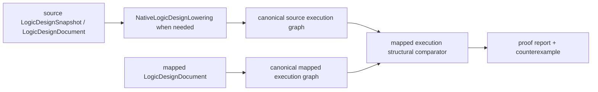

# RTLVerificationEngine Interface Contract

## Common shape

```swift
public protocol DomainExecuting: CircuiteFoundation.Engine {
    func execute(
        _ request: DomainRequest
    ) async throws -> DomainResult
}
```

`RTLVerificationExecuting` is the concrete RTL protocol that refines the
Foundation `Engine` contract. `RTLVerificationResult` is the RTL-owned result
type; its artifact references are Foundation `ArtifactReference` values and
its diagnostics are typed domain diagnostics with a Foundation evidence
projection.

Requests carry a schema version, run ID, typed implementation/reference artifact sets, frontend policy, explicit proof/assumption scope, and an optional retained `RTLVerificationEvidenceInput`. Payloads contain domain findings, coverage, and an `RTLVerificationEvidenceAssessment`. Diagnostics and artifacts belong to `RTLVerificationResult`. The CLI loads the same evidence input through `--record-input` so headless and library execution share one observation evaluator.

`RTLVerificationCorpusRunner` executes a deterministic, uniquely identified set of corpus cases through the same engine protocol, persists each typed result and writes a digest-bound aggregate `RTLVerificationCorpusRun` under the supplied run ID. A corpus run is matched only when every case expectation is satisfied; execution errors are thrown rather than converted into evidence.

`RTLVerificationOracleEvidenceBuilder` persists native and independent-oracle typed results plus an evidence JSON artifact, correlates their payloads, and returns `RTLVerificationOracleEvidenceBuildResult`. A mismatched correlation is retained as a non-auditable result so evidence maturity cannot advance while the failure remains reviewable.

`RTLVerificationLintRuleCatalog` is the versioned repair contract for native lint findings. Each rule declares a stable code, severity, description and suggested actions; a catalog entry does not waive the finding or advance qualification.

Corpus evaluation produces raw measurements and oracle correlation artifacts.
Every retained reference uses Foundation digest and byte-count identity.
ToolQualification reads those artifacts and owns freshness, scope,
independence, health, and trust evaluation. Integrity failures remain typed and
blocked at the consuming policy boundary.

## Products

### RTLLint

Typed RTL diagnostics.

### CDCAnalysis

Clock-domain crossing analysis.

### RDCAnalysis

Reset-domain crossing analysis.

### FormalEquivalence

RTL-to-netlist proof and counterexamples.

### RTLVerificationEngine

Umbrella API.

### Native and external implementations

| Type | Scope |
|---|---|
| `NativeRTLLintEngine` | symbol resolution, width checks, driver checks, sequential assignment checks, combinational loops, undriven outputs |
| `NativeCDCAnalyzer` | sequential clock inference, order-independent source-domain crossings, asynchronous crossings, synchronizer pattern recognition, reconvergence |
| `NativeRDCAnalyzer` | reset inference, reset domain mapping, missing/multiple reset events, reset crossings |
| `NativeFormalEquivalenceChecker` | exact RTL-to-RTL and mapped execution structural equivalence with machine-readable counterexamples |
| `ExternalRTLVerificationEngine` | same result contract for an external command accepted by an injected `ToolTrustDecision`, with exact request-digest binding and solver proof artifact checks |

All native products consume `RTLVerificationParsedDesign`, whose design is the `LogicIR.RTLDesign` canonical state. `SystemVerilogRTLParser` adapts `SystemVerilogFrontend`, expands constant generate blocks and flattens connected top-level hierarchy through `RTLHierarchyElaborator`. It supports ordered implementation and reference source sets, object-like and function-like defines with nested arguments, bounded integer/comparison/logical conditional expressions including `defined(...)`, quoted includes, source maps, parameters, declarations, continuous assignments, sequential/combinational/latch processes, conditionals, case statements, instances, ranges, hierarchy and generate blocks in its declared subset. Unsupported directives, malformed macro invocations, unsupported conditional expressions and hierarchy forms remain in coverage or typed blocked diagnostics.

The corpus runner produces deterministic raw corpus and oracle observations. It
does not grant trust. ToolQualification verifies retained artifact bytes and
issues the trust decision; human approval remains a DesignFlowKernel concern.

`RTLVerificationOracleCorrelationReport` is a comparison result, not a trust decision by itself. `RTLVerificationOracleEvidence` must bind the report to the request digest, digest-bearing native and oracle result artifacts, and explicit independent provenance. `RTLVerificationOracleEvidenceBuilder` additionally verifies that both payloads echo the evidence request digest. `RTLVerificationOracleExecuting` and `ExternalRTLVerificationOracleExecutor` define the independent execution lane; the executor rejects self-correlation and oracle payload digest drift. `RTLVerificationOracleEvidenceValidator` rejects missing bindings or self-correlation. Process evidence records require a complete process scope, implementation-bound health evidence, a validity window, and a retained evidence artifact; ToolQualification decides whether those observations satisfy a trust policy.

External process descriptors carry a finite `timeoutSeconds` value. The Foundation runner applies that deadline, terminates an overdue process tree and returns a typed external-tool failure. `RTLVerificationRequestDigest` defines the canonical sorted-key request encoding and SHA-256 digest. The evidence input is excluded from this canonical encoding because it describes observations about the request and including it would create a circular digest. The external command receives that same canonical JSON on standard input, and its payload must echo the digest; a missing or mismatched digest is an invalid artifact even when run ID, engine ID and descriptor identity match. A solver-backed completed proof additionally requires at least one immutable artifact with a verified SHA-256 digest and byte count; run association is owned by the flow ledger rather than duplicated inside the artifact reference.

The mapped execution proof view is intentionally explicit:



This view ignores mapping-only cell labels and node identifiers, but does not
claim temporal sequential equivalence, analog behavior, or foundry/process
qualification.


## Error contract

- Throw only when execution cannot produce a valid typed domain result.
- Represent design findings and failed checks as typed diagnostics and a completed domain payload.
- Represent missing prerequisites or insufficient semantics as `blocked`.
- Preserve cancellation as `cancelled`.
- Do not swallow parser, process or persistence failures.

## Flow integration

The owning flow package resolves project-relative locators, verifies
Foundation artifact integrity, evaluates ToolQualification requirements,
invokes the injected `RTLVerificationExecuting` protocol and persists the
returned `RTLVerificationResult`. Review, approval and resume remain flow
responsibilities; this package has no dependency on project storage.
