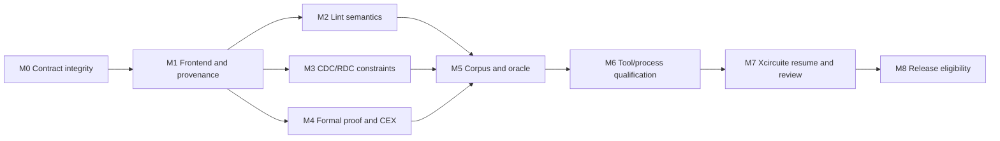

# RTLVerificationEngine Milestones

`RTLVerificationEngine` is a verification platform boundary, not a parser demo. The implementation must separate executable capability from qualification and release eligibility. A completed native execution is therefore not evidence of a qualified signoff backend.

## Delivery model



## Milestone gates

| ID | Outcome | Entry criteria | Exit evidence | Current state |
|---|---|---|---|---|
| M0 | Contract integrity and explicit qualification state | Existing request/result protocols | Versioned qualification report, policy gate, backward-compatible JSON, blocked diagnostics | Complete for schema v1 |
| M1 | Reproducible multi-file RTL frontend | M0 contracts | Preprocessor/elaboration policy, source map, stable entity IDs, language coverage matrix | Canonical SystemVerilogFrontend adapter includes top-module policy, source-set provenance, includes, deterministic defines, `ifdef`/`ifndef`/`elsif`/`else`, parameters, case statements, connected hierarchy flattening and generate blocks; full IEEE elaboration pending |
| M2 | Semantic lint useful for repair | M1 canonical design | Versioned rule catalog, positive/negative corpus, stable finding codes and suggested actions | Versioned native lint rule catalog and repair actions implemented; corpus/oracle qualification remains in progress |
| M3 | Constraint-aware CDC/RDC | M1 frontend and declared clocks/resets | SDC projection, clock/reset graph, synchronizer and reset-release evidence | CDC clock coverage and order-independent source-domain crossings implemented; RDC clock-domain blockers and conservative per-domain reset-release synchronizer evidence implemented; waveform/UPF reset intent and full exception semantics remain in progress |
| M4 | Proof boundary with counterexamples | M1 canonical views | RTL-to-RTL and mapped execution structural contracts, assumptions, qualified solver adapter, typed difference artifact schema | Native RTL-to-RTL and LogicEngine mapped execution boundaries complete with typed counterexample differences; external envelopes bind descriptor identity/version; qualified temporal solver evidence pending |
| M5 | Independent validation | M2–M4 implementations | Retained corpus, expected findings, oracle correlation, false-positive/negative report | Persisted corpus runner, oracle-evidence builder, typed qualification input, artifact-bound oracle evidence contract, process evidence binding and rejection paths complete; external oracle evidence pending |
| M6 | Process/tool qualification | M5 evidence | ToolQualification descriptor, health check, scope, freshness and PDK/deck evidence | Scope, freshness, corpus/oracle/health ID and health implementation identity binding contracts complete; process evidence pending |
| M7 | Headless flow and human review | M6 selection policy | Xcircuite stage adapter, immutable artifacts, resume/cancel, review bundle and approval gate | Serial Xcircuite regression passes 545 tests in 58 suites, including RTL stage/resume, LogicEngine bridge, review and end-to-end contracts; full workspace qualification remains open |
| M8 | Release eligibility | M0–M7 complete | Release profile, audit packet, reproducible CLI/CI run, no unresolved blockers | Blocked |

## Non-negotiable status rules

- `completed` means the requested executable operation returned without an execution error.
- `qualification` is a separate maturity axis and is carried in the result payload.
- A policy may require a minimum qualification state; failure of that gate is `blocked`.
- A structural native equivalence result is never promoted to temporal RTL-to-synthesized or synthesized-to-DFT proof.
- The `rtlToMappedExecutionStructural` view accepts a source LogicDesignSnapshot
  or LogicDesignDocument, lowers snapshots through LogicEngine, compares the
  canonical execution graph, and persists a counterexample on mismatch.
- Unsupported language, missing clock/reset declarations, missing assumptions, stale evidence, and absent process scope remain structured blockers.
- Waivers retain the original finding and record the approving identity and reason.

## Evidence ledger required for M5–M8

```text
.xcircuite/
  runs/<run-id>/
    intent.json
    plan.json
    actions.jsonl
    design-diff.json
    verification/
      result.json
      report.json
      coverage.json
      qualification.json
      counterexamples/
    review/
      findings.json
      waivers.json
      approval.json
```

No milestone may be marked complete from a source declaration alone. The exit evidence must be retained, reproducible and linked to the exact implementation and input artifact digests.
