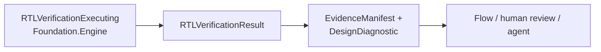
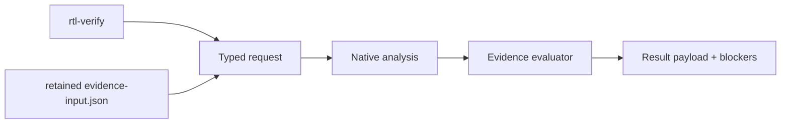
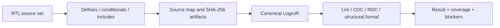

# RTLVerificationEngine

Static RTL quality, clock/reset-domain analysis and formal equivalence contracts.

## Status

The package provides deterministic native implementations for the declared SystemVerilog subset, a canonical `SystemVerilogFrontend` integration with include resolution, object-like and function-like macro expansion, hierarchy elaboration and provenance, a versioned lint rule catalog with repair actions, external and independent-oracle executors bound to the exact request digest, immutable Foundation artifacts, a JSON CLI, persisted retained-corpus and oracle evidence, a typed process-evidence builder with a digest-bound artifact manifest, and an evidence-input artifact auditor.

Native formal equivalence is intentionally scoped to exact canonical structural equivalence for RTL-to-RTL and mapped execution graphs. Mismatch artifacts retain typed difference records containing the difference kind, affected entity and canonical implementation/reference values. The external proof contract requires explicit proof artifact IDs bound to output-role evidence/report artifacts from the same run; every referenced byte stream is reopened and checked against its SHA-256 digest and byte count. This does not claim that an actual temporal solver has been qualified. Process-specific qualification remains blocked until independent tool and process evidence is supplied.

The delivery plan is milestone-based and recorded in [MILESTONES.md](MILESTONES.md). Execution status and evidence maturity are separate: a successful native execution does not imply corpus validation, oracle correlation, ToolQualification acceptance, or release eligibility.

## Verification status

This repository is an implementation milestone, not a foundry signoff claim.

| Gate | Status | Evidence |
|---|---|---|
| Native package build | Passed | `swift build` |
| Xcode package test scheme | Passed | Timeout-bounded `RTLVerificationEngine-Package` workspace verification |
| CLI smoke execution | Passed | Injected artifact root under `rtl-verification/cli-validation/rtl-verification-report.json` |
| Independent oracle correlation | Contract hardened | Native/oracle envelopes, correlation reports and digest-bound evidence artifacts can be persisted; no external independently retained oracle result is attached |
| Process evidence | Contract hardened | Process records require a current retained evidence artifact, a validity window, and corpus/oracle/implementation-matched health evidence IDs; the record is an observation input, not a trust decision |
| Tool/process trust | External | ToolQualification evaluates retained observations and selects eligible implementations |
| Release eligibility | External | The composing flow combines trust, verification, downstream evidence, and human approval |

Cross-package flow verification is owned and reported by the composing package. This repository's release claim is limited to its standalone typed API, CLI, artifacts, diagnostics and timeout-bounded package tests.

## Scope and trust boundary

```mermaid
flowchart LR
    Request["Typed request"] --> Frontend["RTL source-set frontend"]
    Frontend --> IR["Canonical LogicIR + provenance"]
    IR --> Native["Lint / CDC / RDC / structural formal"]
    Native --> Result["RTLVerificationResult"]
    Result --> Evidence["Corpus / oracle / process observations"]
    Evidence --> Trust["ToolQualification policy"]
    Trust --> Review["Xcircuite review / audit / resume"]
```



The native frontend adapts the canonical `SystemVerilogFrontend` into the verification contract. It supports the declared SystemVerilog subset with ordered multi-file inputs, object-like and function-like defines with nested arguments, `if`/`ifdef`/`ifndef`/`elsif`/`else` conditional compilation for bounded integer, comparison, logical and `defined(...)` expressions, quoted includes, include-cycle diagnostics, source maps, parameters, case statements, connected hierarchy flattening, generate blocks and SHA-256 source artifacts. It does not claim complete IEEE SystemVerilog preprocessing, elaboration or synthesis semantics. Unsupported constructs remain in coverage and block according to the request policy.

Native RDC records `resetReleaseDomains` only when every process using a reset in a domain matches a conservative structural pattern: at least two non-blocking reset stages, common asserted constants, a release constant with the opposite value, and a stage-to-stage dependency. Cross-domain resets that do not satisfy this pattern in every consuming domain remain `RDC_UNSAFE_RESET_CROSSING` errors. This is structural evidence, not waveform, UPF or process qualification.

Native formal proves only exact canonical structural equivalence for `rtlToRtlStructural` and the explicitly limited `rtlToMappedExecutionStructural` graph contract. The mapped view lowers a retained LogicIR snapshot into a LogicEngine document and compares it with a retained mapped document; it does not prove temporal execution behavior. Requests for synthesized or DFT proof views, or assumptions that the native backend cannot interpret, are blocked. A mismatch persists a typed counterexample difference artifact for agent inspection and human review. Domain waivers are matched to raw findings, while the composing flow owns acceptance and approval.

RTLVerificationEngine emits digest-bound corpus results, oracle correlation
reports, health observations, and implementation identity. ToolQualification
re-reads those artifacts and owns the trust decision. The verification engine
does not construct a process trust record or infer trust from non-empty IDs.

## Products

| Product | Responsibility |
|---|---|
| `RTLLint` | Typed RTL diagnostics |
| `CDCAnalysis` | Clock-domain crossing analysis |
| `RDCAnalysis` | Reset-domain crossing analysis |
| `FormalEquivalence` | RTL-to-netlist proof and counterexamples |
| `RTLVerificationEngine` | Umbrella API |

## CircuiteFoundation boundary

`RTLVerificationExecuting` refines `CircuiteFoundation.Engine`, so native and
external implementations share the Foundation execution seam.
`RTLVerificationResult` directly exposes digest-bound `ArtifactReference`,
`EvidenceManifest`, and structured `DesignDiagnostic` values without turning
qualification or release policy into a Foundation concern.

Project/run lifecycle is owned by `DesignFlowKernel`; this package emits only
domain results, Foundation artifact evidence and diagnostics. Concrete
`.xcircuite` persistence is owned by `Xcircuite`. This package's stores receive
only an artifact root and typed namespace.



The package is intentionally independent of project storage and flow state. The owning flow package connects this library to `DesignFlowKernel` through the Foundation `Engine` protocol.

## Contract

Every executing product uses:

- a `Codable`, `Hashable`, `Sendable` request conforming to the RTL domain request contract;
- `RTLVerificationResult` for status, diagnostics, artifacts and execution provenance;
- protocol-first dependency injection;
- immutable `CircuiteFoundation.ArtifactReference` inputs and outputs;
- explicit blocked, failed and cancelled states.

Native implementations are `NativeRTLLintEngine`, `NativeCDCAnalyzer`, `NativeRDCAnalyzer` and `NativeFormalEquivalenceChecker`. They share `RTLVerificationEnvironment`, `RTLVerificationDesignLoader`, the canonical `LogicIR` model, and the result finalizer.

Unsupported semantics are retained in `RTLVerificationCoverage` and block the result when they exceed the request policy. Findings remain raw; the payload records domain waiver matches without applying a flow disposition. Oracle correlation is not qualification evidence until `RTLVerificationOracleEvidence` binds the matched report to a request digest, two digest-bearing result artifacts and independent provenance. `ExternalRTLVerificationOracleExecutor` executes the independent lane and rejects self-correlation or payload digest drift. Process qualification is not current until its retained evidence artifact, scope, corpus/oracle/implementation-matched health evidence IDs, qualification timestamp and expiration timestamp are valid at evaluation time.

## CLI

The deterministic JSON CLI verifies a project-relative RTL artifact and writes
the report under `<project-root>/artifacts/rtl-verification/<run-id>/`. Library
consumers inject their own artifact root and namespace, so a composing runtime
can select its storage layout without an adapter.

```bash
swift run rtl-verify --analysis lint --project-root /path/to/project --rtl rtl/top.sv --top top --run-id rtl-lint-001
```

The CLI accepts repeated `--rtl` and repeated `--reference` options for multi-file implementation/reference source sets. Frontend controls include `--define NAME[=VALUE]`, `--include-dir <directory>`, `--language`, and `--max-unsupported`. CDC/RDC can load SDC with `--constraint <path>` and `--constraint-mode <mode>`; parsed clock groups and path exceptions are retained in coverage and are not treated as CDC/RDC safety waivers. Formal equivalence additionally requires at least one `--reference <path>` and accepts `--proof-view` and `--assumptions`. `--record-input <file>` loads `RTLVerificationEvidenceInput` containing retained corpus evaluations and independent oracle correlation/evidence. The evaluator can advance only the raw evidence maturity to `corpusObserved` or `oracleCorrelated`; ToolQualification remains a separate policy input for external implementation selection.



The command emits one deterministic `RTLVerificationResult` JSON document and persists the report through the injected artifact writer. A successful execution can still carry an `unassessed` evidence maturity; evidence limitations are retained in the same payload and are never converted into a ToolQualification or signoff pass.

The current frontend boundary is deliberately explicit:



The parser does not claim complete IEEE SystemVerilog elaboration. Unsupported directives and semantics are counted in coverage and become structured blockers when the request policy requires that boundary.

For a formal run, repeat `--reference` to provide additional reference RTL/header inputs. Use `--reference` only for the reference source set; implementation inputs belong to repeated `--rtl` options.

## Flow integration

A protocol-conforming flow consumer runs each verification product as an independent gate and owns result, trust-decision, review, and audit persistence. Missing proof, a rejected ToolQualification decision, and unsupported semantics remain blocked rather than passed. A solver-backed external proof must name every proof artifact explicitly in `proofArtifactIDs`; each ID must resolve exactly once to an output-role evidence/report artifact. The injected artifact reader reopens the bytes and verifies SHA-256 and byte count before the proof can be considered completed. The Foundation process runner drains stdout and stderr concurrently, starts each tool in an isolated process group, terminates the full tree on timeout or task cancellation, reaps the process and only then finalizes pipe draining.

The library does not depend on the Xcircuite runtime. Flow ownership supplies artifact persistence, qualification gates, repair loops and human approval.

## Build

`Package.swift` resolves every dependency independently. It uses a local
sibling when `../<Package>/Package.swift` exists and otherwise uses the pinned
GitHub revision. No Xcircuite or other umbrella checkout is used as a switch.

| Dependency | Local sibling | Remote fallback revision |
|---|---|---|
| CircuiteFoundation | `../CircuiteFoundation` | `7abcac83517935c9b9f7553d7016d62cffde259d` |
| LogicDesign | `../LogicDesign` | `b9aa25b0b78e6168befa25df3bfe8309bd020a6d` |
| TimingEngine | `../TimingEngine` | `baada25223ccc1225afefa672120ba0d7d1d5d41` |
| ToolQualification | `../ToolQualification` | `d572d950a9dccb699413cd5157d901812354444f` |
| LogicEngine | `../LogicEngine` | `ceafbb9dab29561ebcbf22508a39c712489df8c3` |

```bash
perl -e 'alarm 60; exec @ARGV' -- swift build
```

## Test

```bash
perl -e 'alarm 60; exec @ARGV' -- xcodebuild test -quiet -scheme RTLVerificationEngine-Package -destination 'platform=macOS,arch=arm64' -parallel-testing-enabled NO -maximum-parallel-testing-workers 1
```

The test suite covers request/payload round trips, the versioned repair-oriented lint rule catalog, canonical RTL frontend parameters/case statements, function-like macro expansion, nested arguments, malformed invocation and recursion blocking, bounded conditional expressions and unsupported-expression blocking, connected hierarchy flattening, conditional `elsif` selection, top-module policy and provenance, native lint/CDC/RDC/formal behavior including process-order-independent CDC domain resolution, conservative reset-release synchronizer recognition and mixed-domain blockers, mapped execution graph proof and typed mismatch counterexamples, raw waiver matching, source-set preprocessing, reference provenance, SDC coverage, corpus expectations and persisted corpus runs, canonical request digest binding, digest-bound oracle evidence artifacts, independent oracle execution and self-correlation rejection, real external-process execution, cancellation and process-tree timeout cleanup, process evidence building with artifact-manifest rejection, evidence-input artifact integrity auditing, process evidence freshness/scope binding, ToolQualification-gated external results with descriptor identity and exact request-digest binding, explicit solver proof artifact IDs with byte integrity, proof-view validation, and process timeout forwarding.

See `DESIGN.md`, `INTERFACES.md`, `IMPLEMENTATION_PLAN.md`, `MILESTONES.md` and `GOAL_STATUS.md` before implementing a backend or interpreting a result as qualified.
