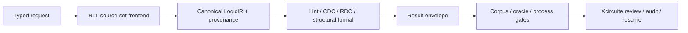
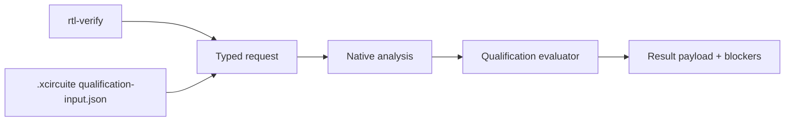
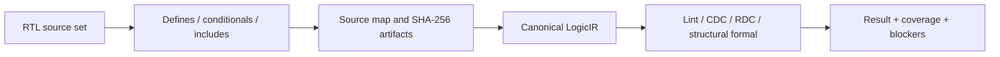

# RTLVerificationEngine

Static RTL quality, clock/reset-domain analysis and formal equivalence contracts.

## Status

The package provides deterministic native implementations for the declared SystemVerilog subset, a canonical `SystemVerilogFrontend` adapter with include resolution, hierarchy elaboration and provenance, a versioned lint rule catalog with repair actions, a qualified-envelope external adapter, immutable JSON artifacts, a JSON CLI, persisted retained-corpus and oracle-evidence builders, retained fixtures, and an Xcircuite flow-stage adapter.

Native formal equivalence is intentionally scoped to exact canonical structural equivalence for RTL-to-RTL and mapped execution graphs. Mismatch artifacts retain both the legacy human-readable messages and typed difference records containing the difference kind, affected entity and canonical implementation/reference values. Solver-backed temporal equivalence and process-specific qualification remain blocked until independent tool and process evidence is supplied.

The delivery plan is milestone-based and recorded in [MILESTONES.md](MILESTONES.md). Execution status and qualification state are separate: a successful native execution does not imply corpus validation, oracle correlation, process qualification or release eligibility.

## Verification status

This repository is an implementation milestone, not a foundry signoff claim.

| Gate | Status | Evidence |
|---|---|---|
| Native package build | Passed | `swift build` |
| SwiftPM contract suite | Passed | 50 tests in 6 suites |
| Xcode package test scheme | Passed | `xcodebuild test -scheme RTLVerificationEngine-Package` |
| CLI smoke execution | Passed | `.xcircuite/runs/cli-validation/rtl-verification-report.json` |
| Xcircuite library target | Passed | `swift build --target Xcircuite` in the sibling integration package |
| Independent oracle correlation | Contract hardened | Native/oracle envelopes, correlation reports and digest-bound evidence artifacts can be persisted; no external independently retained oracle result is attached |
| Process/PDK qualification | Contract hardened | Process records enforce a validity window and bind corpus, oracle and auditable health evidence IDs; no PDK-scoped qualification record is attached |
| Release eligibility | Blocked | Qualification and headless integration evidence remain incomplete |

The Xcircuite library target and the focused RTL/LogicEngine adapter tests have passed in retained integration evidence. The RTL flow suite currently passes native artifact persistence, resume identity checks and qualification blocking for unqualified external tools. Full workspace qualification remains separate from this package evidence.

## Scope and trust boundary



The native frontend adapts the canonical `SystemVerilogFrontend` into the verification contract. It supports the declared SystemVerilog subset with ordered multi-file inputs, object-like defines, `ifdef`/`ifndef`/`elsif`/`else` conditional compilation, quoted includes, include-cycle diagnostics, source maps, parameters, case statements, connected hierarchy flattening, generate blocks and SHA-256 source artifacts. It does not claim complete IEEE SystemVerilog preprocessing, elaboration or synthesis semantics. Unsupported constructs remain in coverage and block according to the request policy.

Native formal proves only exact canonical structural equivalence for `rtlToRtlStructural` and the explicitly limited `rtlToMappedExecutionStructural` graph contract. The mapped view lowers a retained LogicIR snapshot into a LogicEngine document and compares it with a retained mapped document; it does not prove temporal execution behavior. Requests for synthesized or DFT proof views, or assumptions that the native backend cannot interpret, are blocked. A mismatch persists a typed counterexample difference artifact for agent inspection and human review. A waiver preserves the original finding and records its scope, reason and approver.

Process qualification is bound to the retained corpus, oracle and health evidence IDs used by the evaluator. A process record with stale, mismatched or unrelated evidence IDs remains blocked even when its scope and validity window are otherwise complete. Health evidence is represented as auditable qualification evidence with `kind=healthCheck`; an ID in a process record is not sufficient by itself.

## Products

| Product | Responsibility |
|---|---|
| `RTLLint` | Typed RTL diagnostics |
| `CDCAnalysis` | Clock-domain crossing analysis |
| `RDCAnalysis` | Reset-domain crossing analysis |
| `FormalEquivalence` | RTL-to-netlist proof and counterexamples |
| `RTLVerificationEngine` | Umbrella API |

The package is intentionally independent of the Xcircuite runtime. The sibling `Xcircuite` package owns the flow-stage adapter and connects this library to `DesignFlowKernel`.

## Contract

Every executing product uses:

- a `Codable`, `Hashable`, `Sendable` request conforming to `XcircuiteEngineRequest`;
- `XcircuiteEngineResultEnvelope<Payload>` for status, diagnostics, artifacts and execution metadata;
- protocol-first dependency injection;
- immutable `XcircuiteFileReference` inputs and outputs;
- explicit blocked, failed and cancelled states.

Native implementations are `NativeRTLLintEngine`, `NativeCDCAnalyzer`, `NativeRDCAnalyzer` and `NativeFormalEquivalenceChecker`. They share `RTLVerificationEnvironment`, `RTLVerificationDesignLoader`, the canonical `LogicIR` model, and the result finalizer.

Unsupported semantics are retained in `RTLVerificationCoverage` and block the result when they exceed the request policy. Findings are never deleted by waivers; a scoped waiver is recorded on the finding and in the payload. Oracle correlation is not qualification evidence until `RTLVerificationOracleEvidence` binds the matched report to a request digest, two digest-bearing result artifacts and independent provenance. Process qualification is not current until its scope, corpus/oracle/health evidence IDs, qualification timestamp and expiration timestamp are valid at evaluation time.

## CLI

The deterministic JSON CLI verifies a project-relative RTL artifact and writes the report under `.xcircuite/runs/<run-id>/`:

```bash
swift run rtl-verify --analysis lint --project-root /path/to/project --rtl rtl/top.sv --top top --run-id rtl-lint-001
```

The CLI accepts repeated `--rtl` and repeated `--reference` options for multi-file implementation/reference source sets. Frontend controls include `--define NAME[=VALUE]`, `--include-dir <directory>`, `--language`, and `--max-unsupported`. CDC/RDC can load SDC with `--constraint <path>` and `--constraint-mode <mode>`; parsed clock groups and path exceptions are retained in coverage and are not treated as CDC/RDC safety waivers. Formal equivalence additionally requires at least one `--reference <path>` and accepts `--proof-view`, `--assumptions`, and the qualification policy options. `--qualification-input <file>` loads a project package JSON artifact containing health evidence, retained corpus evaluations, independent oracle correlation/evidence, process qualification freshness and optional release approval. The input is evaluated during finalization and can only advance the result when every required evidence gate is satisfied.



The command emits one deterministic JSON envelope and persists the report at `.xcircuite/runs/<run-id>/rtl-verification-report.json`. A successful execution can still carry an `unassessed` qualification state; qualification blockers are retained in the same payload and are never converted into a signoff pass.

The current frontend boundary is deliberately explicit:



The parser does not claim complete IEEE SystemVerilog elaboration. Unsupported directives and semantics are counted in coverage and become structured blockers when the request policy requires that boundary.

For a formal run, repeat `--reference` to provide additional reference RTL/header inputs. Use `--reference` only for the reference source set; implementation inputs belong to repeated `--rtl` options.

## Xcircuite integration

Xcircuite runs each verification product as an independent gate. The RTL stage adapter persists the raw result, qualification report, review bundle and audit record, and reuses a completed or blocked result only when the request digest and audit identity match. Missing proof, insufficient solver qualification and unsupported semantics remain blocked rather than passed.

The library does not depend on the Xcircuite runtime. Xcircuite owns the adapter to `DesignFlowKernel.FlowStageExecutor`, artifact persistence, qualification gates, repair loops and human approval.

## Build

```bash
perl -e 'alarm 60; exec @ARGV' -- swift build
```

The package has local SwiftPM dependencies on `XcircuitePackage`, `LogicDesign`, `LogicEngine`, `TimingEngine` and `ToolQualification`. A standalone checkout therefore needs those sibling packages at the paths declared in `Package.swift`, or an equivalent package-path adjustment.

## Test

```bash
perl -e 'alarm 60; exec @ARGV' -- xcodebuild test -quiet -scheme RTLVerificationEngine-Package -destination 'platform=macOS,arch=arm64' -parallel-testing-enabled NO -maximum-parallel-testing-workers 1
```

For SwiftPM-only checkouts, the equivalent package test command is:

```bash
perl -e 'alarm 60; exec @ARGV' -- swift test --filter RTLVerificationEngineTests
```

The test suite covers request/payload compatibility, the versioned repair-oriented lint rule catalog, canonical RTL frontend parameters/case statements, connected hierarchy flattening, conditional `elsif` selection, top-module policy and provenance, native lint/CDC/RDC/formal behavior including process-order-independent CDC domain resolution and RDC clock-domain blockers, mapped execution graph proof and mismatch counterexamples, waiver persistence, source-set preprocessing, reference provenance, SDC coverage, corpus expectations and persisted corpus runs, digest-bound oracle evidence artifacts, oracle independence and mismatch retention, process qualification freshness and scope binding, qualified external-tool envelopes, proof-view validation, process timeout forwarding and deterministic release blocking.

See `DESIGN.md`, `INTERFACES.md`, `IMPLEMENTATION_PLAN.md`, `MILESTONES.md` and `GOAL_STATUS.md` before implementing a backend or interpreting a result as qualified.
